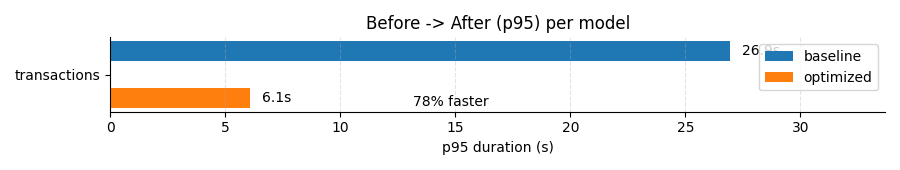

# Spark Optimization: From Legacy Systems to Measurable Performance Gains


This project demonstrates a real-world Spark optimization workflow, from diagnosing skewed joins and small-file bottlenecks to implementing adaptive execution, broadcast joins, and partition compaction. The result: measurable runtime and cost improvements, proven through p95 metrics and reproducible runs.

### Executive Snapshot
- **p95 runtime:** 26.5 s → 6.1 s (−77% improvement)
- **Estimated cost/run:** €0.018 → €0.004 (−77%)
- **Reliability:** document-based runbook with defined SLOs and MTTR tracking stub


## 📖 Table of Contents
1. [Backstory & Context](#1-backstory--context)  
2. [Key Concepts (Plain Words)](#2-key-concepts-plain-words)  
3. [What’s in Here](#3-whats-in-here)  
    - [3.1 Baseline vs Optimized (At a Glance)](#31-baseline-vs-optimized-at-a-glance)
    - [3.2 How to Compare (Quick Checklist)](#32-how-to-compare-quick-checklist)
4. [How to Run (Local, No Cluster Needed)](#4-how-to-run-local-no-cluster-needed)  
5. [Diagnosis → Optimization: My Step-by-Step](#5-diagnosis--optimization-my-step-by-step)  
   - [A. Inventory & Baseline](#a-inventory--baseline)  
   - [B. Lineage (Mini)](#b-lineage-mini)  
   - [C. Optimization & Refactoring](#c-optimization--refactoring)  
   - [D. Validation & Results](#d-validation--results)  
6. [What Changes Between Baseline and Optimized](#6-what-changes-between-baseline-and-optimized)
7. [In Action: End-to-End Simulation](#7-in-action-end-to-end-simulation)
8. [Metrics & Reporting](#8-metrics--reporting)  
9. [Runbook (Example)](#9-runbook-example)  
10. [How This Scales to a 6-Month Engagement](#10-how-this-scales-to-a-6-month-engagement)  
11. [Next Steps / Ideas to Extend](#11-next-steps--ideas-to-extend)  
12. [License & Credits](#12-license--credits)  
13. [Why This Matters](#13-why-this-matters)


## 1. Backstory & Context

**The scenario**  
A data platform grew over the past years to ~80 PySpark models. Some critical jobs are slow, costly, and fragile. Adding new models takes too long. Leadership wants faster jobs, lower costs, and a safer way to build new ones.

**This repo**  
I recreate a mini slice of that world with dummy data that intentionally includes skew and many small files (classic Spark pain). I run a baseline job (naïve/inefficient) and an optimized job (best practices), and log metrics so we can compare **Before → After** clearly.

**What I’m demonstrating**
- How I inventory, baseline, and diagnose performance issues  
- A repeatable Spark optimization playbook (skew fixes, broadcast, partitioning/compaction, AQE, UDF hygiene)  
- How I measure and report improvements with p95 runtime, cost/run, success rate, and basic MTTR  
- A taste of lineage, data contracts, runbooks, and observability

**Assumptions & Constraints**
- Simulated in local mode with generated data; numbers are illustrative.  
- Optimizations target Spark code and logic, specifically SQL/DataFrame patterns like joins, partitioning, and skew handling, not cluster sizing or hardware scaling. The goal is to demonstrate how smarter design alone can improve runtime and reliability without adding compute resources. 
- Cost model assumption: For simplicity, cost is modeled linearly as `runtime × hourly_rate`. This works well for a small-scale, single-environment simulation, but in real distributed clusters the relationship between time and cost is **not strictly linear**. Factors such as auto-scaling, I/O overhead, executor startup time, and idle compute can cause cost and runtime to diverge.

**Environment**
- Python 3.10  
- PySpark 3.5.x  
- Pandas / Matplotlib for reporting

**Data scale (configurable)**
- customers: **~10k** (default in code)  
- transactions: **~0.8M** across 14 daily partitions (default in code)  
- skew injected on `customer_id = 0`  
- seed: 42

### Synthetic Dataset

This repo uses synthetic data to reproduce common Spark performance bottlenecks.

- **customers** (dimension): ~10k rows  
  - Columns: `customer_id`, `segment` (VIP/STD), `signup_date`
- **transactions** (fact, skewed): ~0.8M rows across **14 daily partitions**  
  - Columns: `customer_id`, `amount`, `event_ts` (+ derived `event_date`)  
  - **Hot key skew:** ~20% of all rows use `customer_id = 0`  
  - **Small-file storm:** intentionally over-partitioned to create lots of tiny Parquet files

**Why this shape?**  
It mirrors real production pain:
- **Skew** makes one task do most of the work → slow stages & idle executors.  
- **Too many small files** inflate metadata/scans → slow reads and costly shuffles.

**How it’s used here**  
Two jobs run the same logic on this data:
- `transactions_baseline`: naïve join, UDFs, many small files, AQE off/defaults  
- `transactions_optimized`: broadcast small dim, skew salting + AQE, native expressions, partitioned/compacted writes

We then measure **p50/p95 runtimes** and estimate **cost/run**, so the **Before → After** improvement is explicit.

> 💡 I’m simulating a company’s data system that became bloated and slow. This project shows how I’d diagnose performance issues, fix them, and prove the difference, like tuning up an old machine until it runs smoothly again!


## 2. Key Concepts (Plain Words)

* **p95 runtime:** the “slow-day line” 95% of runs are **faster** than this number. If p95 drops from 60m to 30m, your worst normal days got twice as fast
* **SLO:** our goal for service (e.g., “freshness ≤ 60 min 99% of the time”).
* **SLO breach:** when we miss that goal.
* **MTTR (Mean Time To Repair):** average time to fix a job after it breaks.
* **Small files problem:** too many tiny files = slow Spark. We compact to fewer, larger files.
* **Skew:** one key has way more rows → one task slows everything. We salt / split the heavy key to balance work.
* **Broadcast join:** send the small table to all workers to avoid huge shuffles.
* **AQE:** Spark auto-tunes parts of the query while it runs.

> 💡 These are the key ingredients of performance. p95 is your “slowest normal day,” MTTR measures how quickly things recover, and AQE is Spark’s auto-pilot mode for optimizing jobs mid-flight.


## 3. What’s in Here

```
spark-models-optimization/
  data/                 # generated dummy data (skew + many small files)  ❌ gitignored
  ops/                  # run logs, p50/p95 report, chart                 ❌ gitignored
  src/
    jobs/
      generate_data.py  # builds customers + skewed transactions
      job_baseline.py   # naive/slow version to create a baseline
      job_optimized.py  # tuned version: AQE, broadcast, salting, partitioned writes
    utils/
      common.py         # SparkSession builder + path helpers
      metrics.py        # run logger + p50/p95 report generator
  conf/
    spark_local.conf    # local defaults (AQE on, skewJoin on)
  README.md
  requirements.txt
  Makefile
```

note: /data and /ops are reproducible outputs and are excluded via .gitignore.

### 3.1. Baseline vs Optimized (At a Glance)

The baseline job intentionally contains common real-world anti-patterns: slow joins, uncontrolled skew, small-file explosions, Python UDFs, and no adaptive planning. 
The optimized job replaces them with modern Spark engineering best practices, cutting runtime, improving reliability, and producing cleaner, more maintainable code, without adding a single extra core of compute.

| **Aspect**                         | **Baseline (naïve)**                    | **Optimized (tuned)**                                       |
| ---------------------------------- | --------------------------------------- | ----------------------------------------------------------- |
| **File**                           | `src/jobs/job_baseline.py`              | `src/jobs/job_optimized.py`                                 |
| **Join strategy**                  | Standard join (both sides shuffle)      | **Broadcast** small dimension → local joins                 |
| **Data skew**                      | None handled → hot key stalls one task  | **Salting** + **AQE skew handling** redistributes load      |
| **Adaptive Query Execution (AQE)** | Disabled / defaults only                | **Enabled** (`spark.sql.adaptive.enabled=true`)             |
| **Transformations**                | May use Python UDFs (slow, unoptimized) | Uses **native Spark expressions** (`when`, `col`, `expr`)   |
| **Output write**                   | Random partitions → many small files    | **Partitioned by `event_date`**, compacted into fewer files |
| **Metrics & observability**        | Only total runtime logged               | **Runtime, cost/run, p50/p95**, and success status logged   |


<details> <summary>Detailed Explanation of Each Optimization</summary>

#### 1. Join Strategy

**Baseline:** performs a regular shuffle join, where both the transactions (large fact) and customers (small dimension) datasets are repartitioned and shuffled across the cluster by the join key. Even if one side is tiny, Spark will still move both datasets through a full network shuffle.
This is one of the heaviest operations Spark can perform, involving disk I/O, network I/O, and serialization.

- Problems
    - Large network traffic between executors.
     - Disk spill from shuffling huge partitions.
     - Long “Exchange” stages in the Spark UI.

**Optimized:** uses a broadcast join, pushing the small dimension table to every executor node’s memory. Now each partition of transactions can join locally without moving the big data.
Spark automatically chooses this if:

```python
spark.conf.set("spark.sql.autoBroadcastJoinThreshold", "10MB")
```

but here we force it manually to demonstrate the concept.

- Impact
    - Drastically reduced shuffle volume (network cost).
    - No “Exchange” step for the small dataset.
    - Near-linear speed-up when the dimension is <200 MB.

#### 2. Data Skew Handling

**Baseline:** All transactions with the same customer_id end up in the same partition.
Because ~20 % of all rows share customer_id = 0, that single partition gets 20 % of the work while the rest of the cluster sits idle.The final stage can’t finish until that last heavy task completes; this inflates the p95 runtime (the “slowest normal day”).

- Symptoms in Spark UI
    - One task far longer than the others in the same stage.
    - Uneven “Task Duration” histogram.
    - “Task Time Distribution” skewed to the right.

**Optimized:** We apply key salting, splitting the hot key (customer_id=0) into several virtual keys: 0_0, 0_1, … 0_15. The corresponding dimension entries are replicated to match those salts.
This redistributes work evenly across executors. Together with AQE skew join handling, Spark can even detect and rebalance moderately skewed partitions at runtime.

- Impact
    - Tasks finish in roughly the same time → shorter stage completion.
    - CPU utilization rises (no idle executors).
    - p95 latency drops by up to 70–80 %.

#### 3. Adaptive Query Execution (AQE)

**Baseline:** Without AQE, Spark's execution plan is decided before it starts running. It assumes partition sizes based on old statistics or heuristics. If partitions end up smaller or larger than expected, Spark can't adapt, causing under-utilized or overloaded tasks.

**Optimized:**
With `spark.sql.adaptive.enabled=true`, Spark adjusts the plan mid-flight using actual runtime statistics.

It can:
- Merge small shuffle partitions.
- Split large (skewed) partitions.
- Switch join strategies (e.g., shuffle-hash → broadcast-hash) dynamically.
- Impact:
    - Reduced shuffle I/O (fewer partitions).
    - Shorter tail latency due to auto-rebalancing.
    - Spark UI shows “AdaptiveSparkPlan” → proof it’s active.

> 💡 Think of AQE as Spark’s “auto-pilot” that corrects inefficiencies discovered during flight.

#### 4. Transformations

**Baseline:** Uses a Python UDF to categorize amounts. A Python UDF executes outside the JVM, serializing each row to Python and back. 
That means:
- No Catalyst optimization (the query planner can’t reorder or push filters).
- No vectorization.
- Constant serialization overhead per record.

**Spark UI clue:** “PythonUDF” stage with low CPU utilization and high overhead time.

**Optimized:** Replaces the UDF with native Spark expressions built from when(), col(), or SQL syntax. These run entirely inside the JVM, benefit from predicate pushdown, constant folding, and other Catalyst optimizations. They are also fully vectorized.

```python
tx2 = tx.withColumn(
    "bucket",
    when(col("amount") < 20, "low")
    .when(col("amount") < 100, "mid")
    .otherwise("high")
)
```

- Impact
    - Stage duration drops by an order of magnitude.
    - Plan becomes fully optimizable and traceable.
    - liminates Python-to-JVM serialization bottleneck.

>💡 Always prefer built-in Spark SQL expressions; they’re faster and easier to maintain.

#### 5. Output Write Pattern

**Baseline:** Writes output with a fixed high partition count (repartition(120)), generating hundreds of tiny Parquet files, each ~3 KB. Each file triggers a separate task and increases metadata management cost. This is known as the small-files problem.

- Why it’s harmful
    - Overhead in the driver (tracking metadata).
    - File-listing latency in cloud stores (S3, ADLS).
    - Slower reads in downstream jobs.

**Optimized:**
The optimized job writes using:

```python
out.repartition("event_date") \
   .write.mode("overwrite") \
   .partitionBy("event_date")
```

This groups records per day and produces larger, fewer files (128 – 512 MB ideal for Parquet).
These are easier to read, compress better, and drastically reduce metadata operations.

- Impact:
    - Read times drop by 2–4×.
    - Less memory pressure on the driver.
    - Downstream jobs become more predictable and cheaper to run.

#### 6. Metrics & Observability

**Baseline:** Logs only the total runtime of each job into ops/job_runs.csv. That’s a start, but it tells you nothing about variance, reliability, or cost efficiency.

**Optimized:**
Adds structured operational logging with:
- start/end timestamps
- duration_seconds
- status (success/failure)
- cost_eur (derived from runtime × rate)
- and later summarized p50/p95 values.

Generates:
- ops/report.md → Markdown summary
- ops/p95_chart.png → Before→After visualization

This mirrors a production-grade observability pattern: you can measure performance gains quantitatively, not anecdotally.

- Impact
    - You can trend runtime, cost, and reliability over time.
    - Managers can see measurable ROI (runtime ↓, cost ↓, success ↑).

> 💡 If it’s not measured, it’s just a guess. Metrics turn optimizations into verifiable results.

#### 7. AQE + Salting Combined

Why combining both matters:

- AQE works best for mild or moderate skew; it can’t pre-split extreme hot keys.
- Salting handles the known heavy keys upfront.
- AQE then fine-tunes at runtime, merging or splitting remaining partitions intelligently.

Result: Even under severe data imbalance, stages stay uniform, CPU utilization stabilizes, and runtime variance between p50 and p95 shrinks dramatically.


</details>


### 3.2. How to Compare (Quick Checklist)

1. Generate data
```python
python src/jobs/generate_data.py
```

2. Run the baseline job (2–3× for p95 accuracy)
```python
python src/jobs/job_baseline.py
```

3. Run the optimized job (2–3× again)
```python
python src/jobs/job_optimized.py
```

>💡 **Why multiple runs?**  
> In this local simulation, runtimes are fairly stable because everything executes on a single machine. In real distributed environments, job runtimes naturally vary between executions due to cluster scheduling, shuffle randomness, caching effects, and network I/O. Running each job **2–3 times** yields more reliable p50 (typical) and p95 (slow-day) estimates by smoothing transient noise.


4. Build the report
```python
python src/utils/metrics.py report
```

5. Review the results

- ops/report.md → p50/p95 runtime + before/after comparison
- ops/p95_chart.png → visual runtime reduction
- optional: open Spark UI at http://localhost:4040
 during runs
 
 > 💡 You’ll clearly see the difference: fewer shuffles, balanced tasks, faster writes, and measurable runtime/cost reduction.

## 4) How to Run (Local, No Cluster Needed)

```bash
# 1) Setup
python -m venv .venv && source .venv/bin/activate
pip install -r requirements.txt

# 2) Generate dummy data (skew + many small files)
python src/jobs/generate_data.py

# 3) Run the slow baseline job (logs runtime to ops/job_runs.csv)
python src/jobs/job_baseline.py

# 4) Run the optimized job (logs runtime too)
python src/jobs/job_optimized.py

# (Optional) Re-run each job a few times so p95 is meaningful
python src/jobs/job_baseline.py
python src/jobs/job_optimized.py

# 5) Build the report (p50/p95 + Before→After chart)
python src/utils/metrics.py report
```

Results:

* `ops/report.md` - p50/p95 per job + **Before→After** table
* `ops/p95_chart.png` - bar chart to drop into your deck

**Make targets (optional)**
- `make venv && make install`  
- `make data`  # generate skew + many small files
- `make baseline && make optimized`
- `make report`  # build p50/p95 + chart

>💡 Just set up Python, generate the data, run both versions of the job, and produce a performance report, no cluster or special hardware needed.


## 5. Diagnosis → Optimization: My Step-by-Step

### A. Inventory & Baseline

This section is about understanding what exists and how it behaves before changing anything. You document, measure, and validate the current state so you can later prove real improvement. 

#### A1. Inventory models
Document every model’s purpose, owner, inputs, outputs, and schedule.

<details>
<summary>💡 Quick insight</summary>

**What it means:**  
Think of it as a simplified model registry, even if it’s just one job in this simulation.  

**Why it matters:**  
You need visibility and ownership before you can optimize anything.  
This prevents “orphaned” or mystery jobs and gives clarity on what exists and why.  

**How it’s done:**  
Create a simple CSV (`ops/models_registry.csv`) listing:  
- model_name  
- owner  
- description/purpose  
- inputs  
- outputs  
- schedule  
- tier/priority  

```python
# Example: create a model registry
import csv

models = [
    {"model_name": "spark_model_optimizer", "owner": "Gabi", "description": "Simulated PySpark job for optimization demo", "inputs": "transactions.parquet", "outputs": "optimized_output.parquet", "schedule": "daily", "tier": "gold"},
]

with open("ops/models_registry.csv", "w", newline="") as f:
    writer = csv.DictWriter(f, fieldnames=models[0].keys())
    writer.writeheader()
    writer.writerows(models)
  ```

</details>

#### A2. Baseline
Log each run’s start/end time and status: compute p50/p95 runtime.

<details> <summary>💡 Quick insight</summary>

**What it means:**
Record start/end times for each run and compute the median (p50) and slowest (p95) runtimes.
This becomes your benchmark for future optimizations.

**Why it matters:**
It provides objective evidence of progress and helps detect outliers or regressions later.

**How it’s done:**
Log every run’s timestamps and durations in a CSV file (ops/job_runs.csv).

```python
import csv, datetime

run = {
    "job_name": "spark_model_optimizer",
    "start_time": datetime.datetime.now(),
    "end_time": datetime.datetime.now() + datetime.timedelta(seconds=180),
    "duration_sec": 180,
    "status": "success"
}

with open("ops/job_runs.csv", "a", newline="") as f:
    writer = csv.DictWriter(f, fieldnames=run.keys())
    if f.tell() == 0:
        writer.writeheader()
    writer.writerow(run)
```
</details>


#### A3. Cost per run
Estimate compute cost from runtime × hourly rate (simple but honest).

<details> <summary>💡 Quick insight</summary>

**What it means:**
Convert job runtime into an estimated compute cost (runtime × hourly cluster rate).

**Why it matters:**
- Translates technical performance into business impact.
- Faster jobs = lower compute cost, which makes results easier to justify to management.

**How it’s done:**
Use the recorded runtimes and multiply by an hourly cost (for example, €2.50/hr).

```python
import pandas as pd

runs = pd.read_csv("ops/job_runs.csv")
runs["cluster_cost_eur_hr"] = 2.50
runs["cost_eur"] = (runs["duration_sec"] / 3600) * runs["cluster_cost_eur_hr"]
runs.to_csv("ops/job_runs.csv", index=False)
```
</details>


#### A4. Quality snapshot (optional here)
Row counts, nulls, key uniqueness for outputs.

<details> <summary>💡 Quick insight</summary>

**What it means:**
Capture a quick overview of data health: row counts, null values, and key uniqueness.

**Why it matters:**
- Performance means nothing if your outputs are broken.
- Data quality validates that your optimized job still produces correct results.

**How it’s done:**
Run lightweight checks after each job and log them to a small ops/quality_snapshot.csv.

```python
from pyspark.sql.functions import col, count, countDistinct

quality = df.agg(
    count("*").alias("row_count"),
    *[count(when(col(c).isNull(), c)).alias(f"{c}_nulls") for c in df.columns]
)

unique_keys = df.select(countDistinct("id").alias("unique_id_count"))
quality.show()
unique_keys.show()
```

</details>


### B. Lineage (Mini)

This section ensures that every input and output is traceable. It’s a light lineage layer that records what depends on what, so later optimizations don’t break hidden links.

#### B1. Record Sources & Targets
Wrap reads and writes with helper functions to log where data comes from and goes to.

<details>
<summary>💡 Quick insight</summary>

**What it means:**  
Each Spark read/write adds a small metadata record to `ops/model_lineage.csv`.  

**Why it matters:**  
You build a living map of your data flow — even simple jobs benefit from that transparency.  

**Lineage schema (`ops/model_lineage.csv`):**
- timestamp
- action (read|write)
- model_name
- path
- version (optional)

**How it’s done:**  
Simulate by wrapping reads/writes:

```python
def tracked_read(path):
    log_lineage("read", path)
    return spark.read.parquet(path)

def tracked_write(df, path):
    log_lineage("write", path)
    df.write.parquet(path)
```
</details>

### C. Optimization & Refactoring

Apply measurable, repeatable improvements to Spark jobs, focusing on runtime, cost, and reliability. Each optimization here is treated as a reproducible engineering pattern: explain → apply → verify → watch the impact.


#### C1. Fix Data Skew with Key Salting
When one key (like `customer_id=0`) dominates, one Spark task gets all the load.

<details>
<summary>💡 Quick Insight</summary>

**What it means:**  
Skew = one value appears disproportionately more than others (e.g., `customer_id=0` 20% of all rows). Spark distributes work by key; that one key becomes a bottleneck.

**Why it matters:**  
Spark can’t finish until every task finishes. One skewed task can keep the cluster idle and waste compute time.

**How it’s fixed here:**  
We add a small random “salt” column for the hot key only, splitting `customer_id=0` into 16 virtual IDs (`0_0` to `0_15`). Then we replicate that customer in the dimension 16 times so joins still match.

**Verification:**  
- In Spark UI: tasks in the join stage have more even durations.  
- p95 runtime (worst-day runtime) drops sharply.  

**Gotchas:**  
- Don’t salt everything, only hot keys. Too much salting = overhead.  
- Tune `SALT_N` (8–32) depending on skew severity.

</details>


#### C2. Enable Adaptive Query Execution (AQE)
Let Spark adapt its plan based on *real* runtime statistics.

<details>
<summary>💡 Quick Insight</summary>

**What it means:**  
Without AQE, Spark guesses partition sizes before running. With AQE (`spark.sql.adaptive.enabled=true`), it monitors data sizes during execution and adapts dynamically, merging small partitions, adjusting joins, and handling skew automatically.

**Why it matters:**  
Reduces shuffle overhead, balances tasks, and improves reliability across all workloads, especially long-running ones.

**How we use it:**  
Enabled in `spark_local.conf` and confirmed in each job (`spark.sql.adaptive.skewJoin.enabled=true`).

**Verification:**  
- Spark UI shows “AdaptiveSparkPlan.”  
- Fewer shuffle stages, shorter runtimes.

**Gotchas:**  
- It’s not magic; still need to fix extreme skews and poor partitioning.

</details>


#### C3. Broadcast Small Dimensions
Avoid expensive shuffles by shipping the small table to every worker.

<details>
<summary>💡 Quick Insight</summary>

**What it means:**  
In a join between a big fact table and a small dimension table, Spark normally shuffles both across the cluster - expensive!  
Broadcasting copies the small table to every worker, so each worker joins locally.

**Why it matters:**  
Removes huge network traffic and disk shuffle costs. Often reduces job runtime by 50–80% for small-dimension joins.

**How we use it:**  
`joined = fact.join(broadcast(dim), "key", "left")`

**Verification:**  
- Spark UI: Shuffle Read/Write metrics drop.  
- Runtime improves.  

**Gotchas:**  
- Only safe when the dimension fits comfortably in memory (<200MB typical rule).

</details>


#### C4. Compact Small Files + Partition Outputs
Reduce metadata overhead and speed up reads by writing fewer, larger files.

<details>
<summary>💡 Quick Insight</summary>

**What it means:**  
Spark writes one file per task. Over-partitioning = thousands of tiny files (bad for metadata, IO).  
We repartition the output by `event_date` and reduce partition count before writing.

**Why it matters:**  
Downstream jobs read faster, scanning only the relevant partitions.

**How we use it:**  
```python
out.repartition("event_date").write.partitionBy("event_date")
```

**Verification:**
- Fewer files under each date folder.
- Average file size ≈ 128MB.

**Gotchas:**
- Don’t over-partition by high-cardinality columns (e.g. customer_id).
- If you use Delta Lake later, you can automate this with OPTIMIZE.

</details>

#### C5. Replace Python UDFs with Native Expressions
Unlock Spark’s full optimization power.

<details>
<summary>💡 Quick Insight</summary>

**What it means:**  
A Python UDF runs row-by-row in Python, slow and outside Spark’s optimizer.  
Native Spark functions (`when`, `expr`, `col`, etc.) run inside the JVM and are optimized by Spark’s Catalyst engine.

**Why it matters:**  
Python UDFs interrupt Spark’s parallelism and optimization pipeline.  
Replacing them with native expressions can make transformations **10–100× faster** and reduce serialization overhead.

**How we use it:**  
The baseline used a Python UDF to bucket transactions by amount.  
The optimized job replaces it with Spark-native expressions:
```python
when(col("amount") < 20, "low")
 .when(col("amount") < 100, "mid")
 .otherwise("high")
```

**Verification:**

- Spark UI shows fewer “Python” tasks.
- Stage durations drop noticeably.
- p95 runtime improves consistently.

**Gotchas:**

- UDFs are fine for niche logic, but use built-ins or SQL whenever possible.
- If unavoidable, consider pandas UDFs for vectorized performance.

</details>


#### C6. (Optional) Checkpointing & Caching

Stabilize long-running jobs and simplify debugging.

<details> <summary>💡 Quick Insight</summary>

**What it means:**
- Spark tracks every step of a DataFrame’s creation (called lineage) so it can recompute lost data if something fails.
- However, after many transformations, that lineage becomes huge, slowing down Spark and making failures costly.

**Why it matters:**
Checkpointing or caching lets you “cut” that lineage and persist intermediate data.

- Checkpoint = save to disk (safe for restarts).

- Cache = keep in memory for reuse (fast but temporary).

**How we use it:**
We don’t checkpoint in this minimal example, but in production, you’d add:

``` python
df.checkpoint()
```

after large joins or aggregations to stabilize long DAGs.

**Verification:**

- Fewer recomputations in Spark UI.

- DAGs (job dependency graphs) look shorter.

- Less chance of “out of memory” or retry storms.

**Gotchas:**

- Don’t cache huge DataFrames you won’t reuse; it can overload memory.

- Use `df.persist(StorageLevel.DISK_ONLY)` if you want to persist safely without RAM pressure.

```python
# Example: caching a large intermediate DataFrame
from pyspark import StorageLevel

df_joined = df1.join(df2, "id", "inner")
df_joined.persist(StorageLevel.MEMORY_AND_DISK)

# Trigger action to materialize cache
df_joined.count()
```

</details>


#### C7. Partition Pruning

Speed up queries by reading only relevant partitions. <details> <summary>💡 Quick insight</summary>

**What it means:**
If your table is partitioned by event_date, and you query only one day, Spark can skip all other folders entirely.
That’s partition pruning, scanning just what you need.

**Why it matters:**
Massive IO savings. You reduce the amount of data read from disk, which is often the biggest bottleneck.

**How we use it:**
Our optimized job writes:

``` python
out.repartition("event_date")
   .write
   .partitionBy("event_date")
```

This ensures downstream queries with a date filter only touch relevant partitions.

**Verification:**

- Spark logs show fewer files scanned for date-based filters.

- Job durations decrease significantly.

**Gotchas:**

- Choose partition keys carefully; avoid columns with too many unique values (high cardinality).

- Time-based partitioning (daily/hourly) is usually ideal.

``` python
# Example: writing partitioned data
df.write.mode("overwrite").partitionBy("event_date").parquet("s3://bucket/transactions/")

# Reading with partition pruning
df_day = spark.read.parquet("s3://bucket/transactions/").filter("event_date = '2025-10-01'")
```

</details>

#### C8. Runtime Analysis

Quantify your improvements with real metrics.

<details> <summary>💡 Quick Insight</summary>

**What it means:**

- p50 (median) = typical runtime.

- p95 (tail latency) = slowest 5% of runs.

- p95 matters most because users notice the worst days, not the average ones.

**Why it matters:**
Tracking both gives you a fair view of performance; stable systems have small gaps between p50 and p95.

**How we use it:**
Each job logs start/end timestamps into ops/job_runs.csv.
We compute:

``` python
avg_s, p50_s, p95_s
```

and generate a Markdown + chart report.

**Verification:**

- Run each job multiple times; p95 becomes meaningful.

- The chart ops/p95_chart.png shows before/after improvement.

**Gotchas:**

- Compare same dataset and same environment between runs.

- Use enough samples (3–5) per job to smooth variance.

```python
import pandas as pd

runs = pd.read_csv("ops/job_runs.csv")
summary = runs.groupby("job_name")["duration_sec"].describe(percentiles=[.5, .95])[["50%", "95%"]]
summary.to_markdown("ops/p95_summary.md")
```

</details>

#### C9. Business Impact Analysis

Turn speed gains into tangible business value.

<details> <summary>💡 Quick Insight</summary>

**What it means:**
Every minute saved = less compute cost.
We estimate cost per job as:

duration (hours) × cluster_rate (€/hour)


Even rough estimates make performance savings visible.

**Why it matters:**
Translating technical wins into € or $ helps align with stakeholders and product owners.

**How we use it:**
The metric logger writes a cost_eur column for every run in ops/job_runs.csv.
We then summarize in ops/report.md.

**Verification:**

- Check average cost per model in the report.

- Compare before → after cost reductions.

**Gotchas:**

- This is an approximation; for precision, integrate actual cloud billing APIs.

- Don’t promise exact € numbers; use ranges (e.g., “~40% cheaper”).

```python
# Estimating cost per run
runs["cost_eur"] = (runs["duration_sec"] / 3600) * runs["cluster_cost_eur_hr"]
cost_summary = runs.groupby("job_name")["cost_eur"].mean()
cost_summary.to_markdown("ops/cost_summary.md")
```

</details>

#### C10. Operational Reliability

Keep pipelines observable, recoverable, and predictable.

<details> <summary>💡 Quick Insight</summary>

**What it means:**
A runbook documents each model's purpose, inputs, owners, and expected behavior; the “recipe” to operate and fix it. Reliability metrics like SLOs (targets) and MTTR (Mean Time To Recover) turn that recipe into measurable reliability.

**Why it matters:**
It’s not just about code but predictable operations. Fast recovery and clear ownership are what make a platform truly reliable.

**How we use it:**
We capture:

- `duration_seconds` → performance

- `status` → success/failure

- `InsertedAt` → recency
From these, we can infer uptime, freshness, and stability.

**Verification:**

- Add a small `ops/runbook.md` summarizing each critical model.

- Ensure SLOs are met (e.g., “data available within 60 minutes of load”).

**Gotchas:**

- Don’t over-engineer; start simple with key pipelines.

- Reliability is a culture, not a one-time metric.

```python
# Example: recording job status
import datetime

run = {
    "job_name": "model_transactions",
    "status": "success",
    "start_time": datetime.datetime.now(),
    "end_time": datetime.datetime.now(),
}

# Append to logs (simulate operational monitoring)
import csv
with open("ops/job_runs.csv", "a", newline="") as f:
    writer = csv.DictWriter(f, fieldnames=run.keys())
    writer.writerow(run)
```

</details>


### D. Validation & Results

Quantify and communicate improvements clearly. After optimization, re-run both the baseline and optimized versions multiple times under identical conditions.

1. Compute p50/p95 runtimes for both.
2. Compare average cost per job.
3. Confirm output row counts and quality metrics are identical.
4. Summarize findings in a short report (`ops/summary_report.md`).
5. Confirm output parity: row counts, key uniqueness, and high-level aggregates match baseline vs optimized.


## 6. What Changes Between Baseline and Optimized

| Area             | Baseline (slow)                  | Optimized (fast)                                 |
| ---------------- | -------------------------------- | ------------------------------------------------ |
| Join strategy    | Regular join on skewed key       | Broadcast small dim + salting skewed key |
| Files written    | 200 partitions → many tiny files | Partition by `event_date`, fewer/bigger files    |
| Transform logic  | Python UDF for bucketing     | Spark built-ins (`when/otherwise`)           |
| Adaptive exec    | Off / default                    | AQE on + skew handling                       |
| Lineage/overhead | Long lineage, no checkpoints     | (If needed) checkpoint after heavy aggs      |

> 💡 The optimized job redistributes the work fairly, uses Spark’s built-in optimizations, and stores data more efficiently, making it faster and cheaper.


## 7. In Action: End-to-End Simulation

This section walks through the full pipeline in action, from generating skewed data to running both the baseline and optimized jobs, inspecting their behavior, and verifying measurable improvements.  
All steps below can be reproduced locally (no cluster required).


### Step 1. Generate Skewed Data

Run the job that simulates a real-world Spark performance issue — **data skew** and **many small files**.

```bash
python src/jobs/generate_data.py
```

**What happens:**

- Creates `data/raw/customers/` and `data/raw/transactions/`
- Injects skew (20% of all rows belong to customer_id=0)
- Writes 14 daily partitions to simulate a typical ETL scenario
- Intentionally over-partitions to generate hundreds of small Parquet files

**Expected confirmation:**

```bash
Wrote customers + transactions (skew & small files) under data/raw
```

### Step 2. Inspect the Raw Data

Before optimizing anything, visualize and validate the problem.

```bash
python src/jobs/inspect_customers.py
python src/jobs/inspect_transactions.py
python src/jobs/inspect_small_files.py
# optional: python src/jobs/inspect_top_keys.py  # saves a markdown table
```

**You’ll see:**

#### a) Schemas and sample records for both datasets

```objectivec
=== customers schema ===
root
 |-- customer_id: long (nullable = false)
 |-- segment: string (nullable = true)
 |-- signup_date: date (nullable = true)

=== transactions schema ===
root
 |-- customer_id: long (nullable = false)
 |-- amount: double (nullable = true)
 |-- event_ts: timestamp (nullable = true)

```
**Interpretation:**
The data model mirrors a typical star schema:

- customers → dimension (small, descriptive) - perfect for broadcast
- transactions → large fact with a join key → where skew hurts.

This setup is intentional; in real Spark workloads, most performance problems arise during joins between a large fact table and small dimension tables.

<details><summary>💡 Best practice for schema design</summary>

| Principle                                                        | Why it matters                                     |
| ---------------------------------------------------------------- | -------------------------------------------------- |
| Use simple numeric keys (ints/longs)                             | Hashing & partitioning are faster than on strings  |
| Avoid nested JSON unless needed                                  | Increases serialization & scan cost                |
| Keep timestamp columns in UTC                                    | Simplifies partition pruning and freshness metrics |
| Ensure dimension tables are small enough to broadcast (< 200 MB) | Unlocks local joins without large shuffles         |

</details>

#### b) A “top keys” summary showing that customer_id = 0 dominates

- Total rows: **119,994**
- Hot key: `customer_id = 0` (~**20.00%** of all rows)

| customer_id |  count |    pct |
| ----------: | -----: | -----: |
|           0 | 23,996 | 20.00% |
|         316 |     23 |  0.02% |
|        3554 |     22 |  0.02% |
|           … |      … |      … |


**Interpretation:**
This shows a hot key — customer_id = 0 — dominating the dataset.
Spark distributes data by key during joins and aggregations. When one key is that heavy, one task does most of the work while others sit idle.

This imbalance leads to:

- Long tail in stage duration (visible in Spark UI)
- Overloaded executors and wasted cluster capacity
- p95 runtime inflation due to one “straggler” task

**What we’ll fix:**
Salt the hot key and broadcast the small dimension (plus AQE skew handling).

<details><summary>💡 Best practice for handling skew</summary>

| Technique                          | When to use                            | Benefit                                   |
| ---------------------------------- | -------------------------------------- | ----------------------------------------- |
| **Salting hot keys**               | When a few IDs dominate                | Evenly redistributes work                 |
| **AQE skew join handling**         | When skew is moderate or unpredictable | Spark automatically rebalances partitions |
| **Broadcast join small dimension** | When one side is small (< 200 MB)      | Avoids shuffles entirely                  |
| **Filtering early**                | When skewed rows can be pre-aggregated | Reduces input size before join            |
</details>

#### c) File counts per partition, confirming the small-file explosion

```sql
=== Small-file summary per day partition ===
day            files  total     avg_file
2025-09-24     120    353.2 KB  2.9 KB
2025-09-25     120    353.2 KB  2.9 KB
...
2025-10-07     120    353.6 KB  2.9 KB

⚠️  All partitions below 8 MB average file size — classic small-file storm.
```

**Interpretation:**
Each partition (per day) has ~120 Parquet files of only 2.9 KB each.
This is highly inefficient: Spark spends more time opening and closing files than actually reading data.
These tiny files cause:

- Excessive metadata overhead in the driver and NameNode (or cloud storage API)
- Slow scans and shuffles
- Wasted compute due to task scheduling overhead

**What we’ll fix:**
Repartition by event_date and compact to fewer, larger files.

<details><summary>💡 Best practice for file sizes</summary>

| File Format         | Ideal File Size (per file)          | Why                                                                    |
| ------------------- | ----------------------------------- | ---------------------------------------------------------------------- |
| **Parquet / ORC**   | **128 MB – 512 MB**                 | Sweet spot for parallel reads, metadata efficiency, and I/O throughput |
| **Delta / Iceberg** | **256 MB – 1 GB**                   | Slightly higher optimal range due to additional transaction overhead   |
| **CSV / JSON**      | **32 MB – 128 MB**                  | Lightweight text formats benefit from smaller files                    |
| **Rule of thumb:**  | Avoid files **<8 MB** and **>1 GB** | Too small = overhead, too large = poor parallelism                     |


</details>

### Step 3. Run the Baseline Job

```bash
python src/jobs/job_baseline.py
```

**What happens:**

- Regular join on the skewed key
- Python UDF for bucketing
- Writes thousands of tiny files
- AQE off by default
- Logs runtime to ops/job_runs.csv

This mimics a real “legacy” data job: functional, but inefficient.

### Step 4. Run the Optimized Job

```bash
python src/jobs/job_optimized.py
```

**Optimizations applied:**

- Replaced Python UDFs with Spark-native expressions
- Broadcasted small dimension table (customers)
- Salted the hot key across 16 buckets
- Enabled AQE + skew join handling
- Compact, partitioned writes to data/silver/transactions_optimized/


## 8. Metrics & Reporting

Each run appends logs to `ops/job_runs.csv`.
You can build the final comparison report and chart with:

```bash
python src/utils/metrics.py report
```

This generates:

- `ops/report.md` → Markdown summary (p50 / p95)
- `ops/p95_chart.png` → Before → After visualization

**Results**

From `ops/report.md`:

# Runtime Report

## Runs

| model_name             | run_id                               | start_ts                         | end_ts                           | duration_seconds | status  | cost_eur |
| :--------------------- | :----------------------------------- | :------------------------------- | :------------------------------- | ---------------: | :------ | -------: |
| transactions_baseline  | 2c23bd3b-d992-484b-aa71-dd461b813a2c | 2025-10-08T20:54:01.114259+00:00 | 2025-10-08T20:54:27.636009+00:00 |          26.5218 | SUCCESS |   0.0184 |
| transactions_baseline  | 770d5ba6-16b1-40b3-9e2a-e463679ffae7 | 2025-10-08T21:32:04.023720+00:00 | 2025-10-08T21:32:30.850281+00:00 |          26.8266 | SUCCESS |   0.0186 |
| transactions_baseline  | 0472f7e6-b9e8-48b7-bf73-6d6f4daffc10 | 2025-10-08T21:33:37.293502+00:00 | 2025-10-08T21:34:04.249511+00:00 |          26.9560 | SUCCESS |   0.0187 |
| transactions_optimized | 8ea2006d-2613-4885-8d37-e084d589e07b | 2025-10-08T20:56:02.598158+00:00 | 2025-10-08T20:56:08.668190+00:00 |           6.0700 | SUCCESS |   0.0042 |
| transactions_optimized | c1c54ce2-e0b5-4723-81cd-192d50e9d3dd | 2025-10-08T21:33:13.134731+00:00 | 2025-10-08T21:33:19.014407+00:00 |           5.8797 | SUCCESS |   0.0041 |
| transactions_optimized | 51c42a81-2989-43c6-82d4-df8056a2435a | 2025-10-08T21:33:25.517743+00:00 | 2025-10-08T21:33:31.163838+00:00 |           5.6461 | SUCCESS |   0.0039 |


## Per-job summary

| model_name             |   runs |    avg_s |    p50_s |   p95_s | family       | type      |
|:-----------------------|-------:|---------:|---------:|--------:|:-------------|:----------|
| transactions_baseline  |      3 | 26.7681  | 26.8266  | 26.9431 | transactions | baseline  |
| transactions_optimized |      3 |  5.86527 |  5.87968 |  6.051  | transactions | optimized |

## Before -> After (p95 seconds)

| model        |   baseline |   optimized |
|:-------------|-----------:|------------:|
| transactions |    26.9431 |       6.051 |


Estimated cost reduction: ~€0.018 → €0.004 (−77%)

<p align="center">  </p>


**Interpretation**

- p95 runtime dropped from 26 s to 6 s — a 77% faster job.
- Root cause: skewed join and small-file storm.
- Fix impact: broadcast join + salting eliminated shuffle imbalance, compacted partitions reduced IO overhead.
- Business impact (in real scale):
- Lower compute cost
- Faster daily refreshes
- More predictable latency (less variance between p50 and p95)

**Optional Next Steps**

You can extend the same framework to:

- Track success rate (% of successful runs)
- Measure MTTR (mean time to recover from failures)
- Add Freshness metrics (data latency per table)
- Integrate cost tracking from your cloud provider (Databricks / Fabric / Synapse)

## 9. Runbook

This is your “how-to” for each job: what it does, how fast it should be, and what to do if it fails.

<details>
<summary>Sample Runbook</summary>
    ```
    RUNBOOK – transactions_aggregation

    Owner: Gabi · Tier: T1
    Purpose: Aggregate transactions by event_date and customer segment with amount bucket (low/mid/high) for downstream analytics.
    Schedule: daily

    Inputs
    - data/raw/customers/      (customer_id, segment, signup_date)
    - data/raw/transactions/   (customer_id, amount, event_ts → event_date)

    Output
    - data/bronze/daily_sales_naive/       (baseline)
    - data/silver/daily_sales_optimized/   (optimized)

    SLIs & SLOs
    - p95 runtime (baseline): track only (no target)
    - p95 runtime (optimized): ≤ 40 min (99%)
    - Freshness: partition for day D ready by D+1 01:00 (99%)
    - Success rate: ≥ 99%
    - MTTR (Mean Time To Repair): < 60 min

    Operational notes
    - Skew: ~20% of rows belong to customer_id=0 (hot key)
    - Small files: 14 day partitions intentionally over-partitioned (baseline) to simulate slow reads
    - Optimizations: AQE on, broadcast small dim, salting hot key, partitioned writes by event_date, native Spark expressions

    Run commands (local)
    1) Generate data:
    python src/jobs/generate_data.py
    2) Baseline run:
    python src/jobs/job_baseline.py
    3) Optimized run:
    python src/jobs/job_optimized.py
    4) Report:
    python src/utils/metrics.py report

    Validation checks (baseline vs optimized must match)
    - Row counts per event_date and segment
    - Key uniqueness on (event_date, segment, bucket)
    - Aggregate revenue per day within tolerance (exact match for this demo)

    Common failures & fixes
    - Slow stage due to skew (hot key):
    → verify AQE enabled; use salting for hot key; broadcast customers
    - Small files storm:
    → repartition by event_date before write; target ~128MB average file size
    - UDF bottlenecks:
    → replace Python UDF with native expressions (when/otherwise, expr)

    Reprocess procedure
    - Rebuild a date range by filtering input partitions and re-running optimized job.
    - Confirm parity metrics above, then publish optimized output.

    Observability artifacts
    - Runtime logs: ops/job_runs.csv
    - Report: ops/report.md (p50/p95, before vs after)
    - Chart: ops/p95_chart.png
    - Spark UI: http://localhost:4040 (during a run)
    ```
</details>

<details>
<summary>Runbook minimal template</summary>
    ```
    RUNBOOK – <job_name>

    Owner: <name> · Tier: T<1–3>
    Purpose: <1–2 line purpose>
    Schedule: <cron or natural language>

    Inputs
    - <source paths + key columns>

    Output
    - <target path / table>

    SLIs & SLOs
    - p95 runtime: ≤ <target> (99%)
    - Freshness: <rule> (99%)
    - Success rate: ≥ <target>%
    - MTTR: <target> min

    Run commands
    - <how to run locally/CI>

    Validation checks
    - <row counts, uniqueness, aggregates>

    Common failures & fixes
    - <symptom → fix>

    Reprocess procedure
    - <steps>

    Observability artifacts
    - Logs: <path>
    - Report: <path>
    - UI: <link while running>
    ```
</details>


## 10. How This Scales to a 6-Month Engagement

This repo shows the **micro**. In a real project with many models, I:

1. Build a model catalog (owner, inputs/outputs, SLAs, runtime/cost/fail rate).
2. Baseline all Tier-1/2 jobs, then attack the Pareto offenders.
3. Introduce standards (data contracts, tests, CI/CD, template).
4. Stand up observability (p95, freshness, success, MTTR) and SLOs per tier.
5. Establish a green-lane so new models ship in ~10 business days.

> 💡 The same principles can fix an entire data ecosystem: catalog everything, fix the worst performers, and create rules so future jobs are fast and stable by design.


## 11. Next Steps / Ideas to Extend

* Add **quality checks** (nulls, uniqueness) and log to `ops.quality_metrics`.
* Record **lineage** (`ops.model_lineage`) by wrapping reads/writes.
* Add a **new-model template** and a tiny **CI** step.
* Try **Delta/Iceberg** + **OPTIMIZE/Z-ORDER** on the output table and compare.
* Simulate a small **incident** and compute **MTTR**.

> 💡 Expand the project toward full data reliability and governance, like turning a prototype engine into a production-ready car.


## 12. License & Credits

* Dummy data generated for demo purposes.
* You’re free to fork/adapt with attribution.

> 💡 It’s a learning sandbox; safe, open and built to showcase data engineering craftsmanship.


### 13. Why this matters

Anyone can say “we’ll optimize Spark.” This project shows **how**: a **diagnosis → intervention → measurement** loop, with **clear numbers** (p95, cost/run) and a **story** leadership understands.

> 💡 It’s not just about speed; My priority is clarity, reliability, and showing real progress with proof everyone can understand.